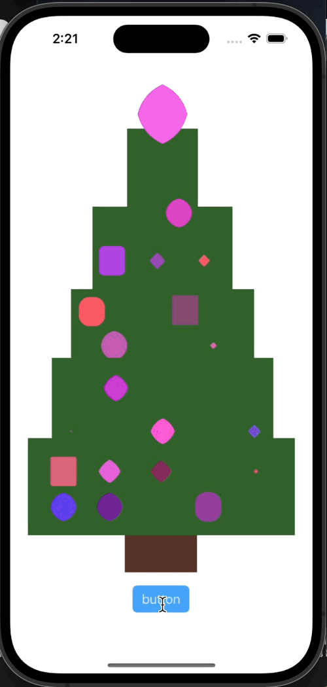

# Домашнее задание номер 1

написать приложение c использованием StoryBoard, в котором при нажатии кнопки множество ```View``` меняет свои цвета и форму

## [полное техническое задание](HW1-rus.pdf)

----
## Результат


